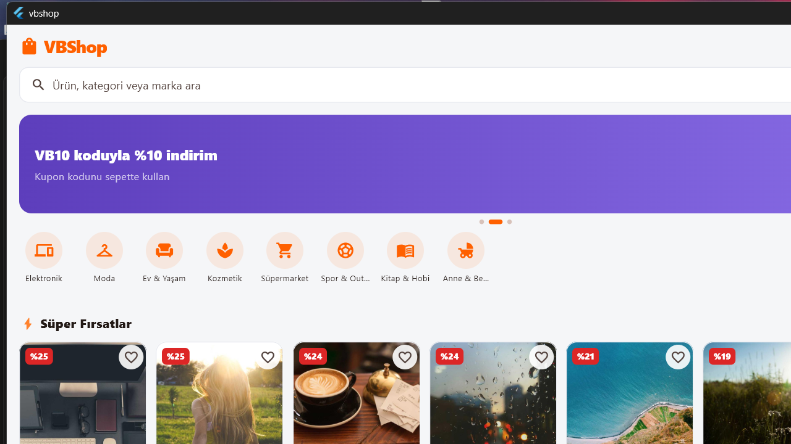
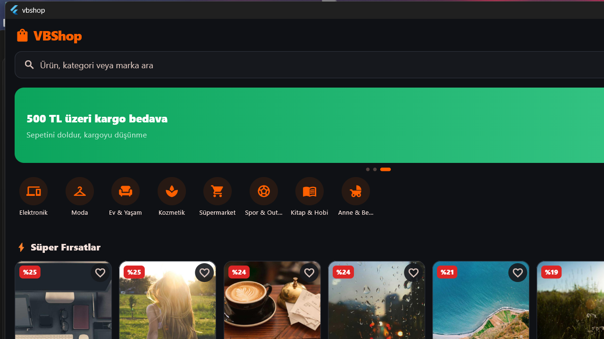

# 📱 VBShop - E-Ticaret Mobil Uygulaması 

> **VB10 Staj 2026 · E-Ticaret Ana Projesi · Mobil Teslimatı**
> Uçtan uca e-ticaret mobil uygulaması. API sözleşmesi: [`Docs/ecommerce_api_contract_v1.3.md`](../Docs/ecommerce_api_contract_v1.3.md)
> Flutter · Riverpod · go_router · Dio · Clean Architecture

---

## Ekranlar ve Özellikler

| Alan | Özellikler |
|---|---|
| 🏠 Ana Sayfa | Otomatik kayan kampanya banner'ları, kategori şeridi, ⚡ Süper Fırsatlar rayı, Öne Çıkanlar, En Beğenilenler grid'i, pull-to-refresh |
| 🔍 Arama & Filtre | Arama geçmişi (kalıcı), popüler aramalar, Türkçe karaktere duyarsız arama, fiyat/puan/stok filtreleri, 6 sıralama seçeneği, sonsuz kaydırma (sayfalama) |
| 📦 Ürün Detay | Görsel galerisi, indirim/kargo/stok rozetleri, satıcı bilgisi, açıklama, **yorumlar + yorum yazma**, benzer ürünler |
| 🛒 Sepet | Adet güncelleme, stok doğrulama, **kupon kodları** (`VB10`, `HOSGELDIN50`), **kargo bedava ilerleme çubuğu** (500 TL eşiği), tutar özeti |
| 💳 Checkout | 3 adımlı akış: adres seçimi → kart formu (maskeleme + doğrulama, **ödeme simülasyonu**) → özet & onay; sipariş sonrası stok düşer |
| 🧾 Siparişler | Sipariş geçmişi, sipariş detayı, **durum takip zaman çizelgesi** (Onay Bekliyor → Hazırlanıyor → Kargoda → Teslim) |
| ❤️ Favoriler | Hesaba bağlı favoriler (backend `CustomerOnly`), her yerden kalp ile ekle/çıkar; mock modda misafir de cihaz-yerel favori ekleyebilir |
| 👤 Hesap | Login/Register (demo hesap kısayolları), **e-posta doğrulama**, **şifremi unuttum/sıfırla**, misafir modu, adres defteri (CRUD), **profil düzenleme**, **şifre değiştirme**, **hesabı sil**, açık/koyu tema, güvenli çıkış |
| 🛠️ **Admin Paneli** | Rol bazlı erişim; dashboard (ciro, sipariş, müşteri, stok istatistikleri), **ürün CRUD**, **sipariş durumu yönetimi** |
| 🤖 **AI Asistan** | Sağ-alt köşede yüzen sohbet asistanı (web'deki Gemini asistanının portu); mevcut `Web` uygulamasının `/api/ai/chat` ucunu proxy olarak kullanır — API key mobile hiç gömülmez |
| 🎉 **Karşılama Kampanyası** | Misafir kullanıcıya açılışta bir kez gösterilen üyelik kampanya modalı (web'deki `WelcomeCampaignModal`'ın sadeleştirilmiş portu) |

**Edge-case'ler bilinçli tasarlandı:** boş durumlar, skeleton yükleme, hata + tekrar dene, stok tükendi, "Son X ürün!" uyarısı, geçersiz/eşik altı kupon, boş sepetle checkout engeli.

## Demo Hesaplar & Kuponlar

| Rol | E-posta | Şifre |
|---|---|---|
| Müşteri | `demo@vbshop.com` | `demo123` |
| **Admin** | `admin@vbshop.com` | `admin123` |

Kuponlar: `VB10` (%10) · `HOSGELDIN50` (300 TL üzeri 50 TL). Kargo 500 TL üzeri bedava.

## Neden Bu Teknolojiler?

- **Flutter:** Tek kod tabanıyla iOS + Android (bonus: web/masaüstü önizleme). Ekipte tek mobilci olduğum için iki native kod tabanı sürdürülemezdi; Flutter'ın widget sistemi tasarım ekibinin token'larını birebir uygulamayı kolaylaştırıyor.
- **Riverpod 3:** İş mantığını UI'dan tamamen ayırıyor (controller'lar test edilebilir), derleme zamanı güvenli, `ref.invalidate` ile cache tazeleme deseni sipariş/stok senkronizasyonunu basitleştirdi.
- **go_router:** Deklaratif rota tanımı + `redirect` ile **auth guard** (korumalı sayfalar `/login?redirect=...`'e yönlenir, admin rotaları rol kontrolünden geçer).
- **Dio + json_serializable:** Tipli modeller ve interceptor'lı ağ katmanı; token otomatik eklenir, hatalar RFC 9457 Problem Details formatına göre kullanıcı dostu mesajlara çevrilir.
- **flutter_secure_storage:** Token'lar düz metin değil, platformun güvenli deposunda (Keystore/Keychain).

## Mimari

Clean Architecture - her feature üç katman:

```
lib/
├── core/                  # tema, router, Dio, hata tipleri, MockDatabase, ortak widget'lar
└── features/<feature>/
    ├── domain/            # entity'ler + repository SÖZLEŞMELERİ (saf Dart)
    ├── data/              # tipli modeller (json_serializable), mock + remote datasource, repo impl
    └── presentation/      # Riverpod controller/provider + ekranlar (UI "aptal")
```

Feature'lar: `auth`, `catalog`, `cart`, `favorites`, `orders` (checkout dahil), `profile`, `admin`, `ai`, `shell`.

### Backend Entegrasyonu

Backend (.NET, bkz. `../API`) artık ayakta; tüm feature'lar (`auth`, `catalog`, `cart`, `favorites`, `orders`, `profile`, `admin`) gerçek API'ye bağlı ve varsayılan çalışma modu budur.

- Endpoint haritası [`lib/core/network/api_endpoints.dart`](lib/core/network/api_endpoints.dart) dosyasında; her feature'ın `data/datasources/*_remote_data_source.dart` dosyası ilgili controller'ın sözleşmesine göre yazıldı.
- `DioClient` (`lib/core/network/dio_client.dart`) `ApiResponse` zarfını açar, 401 aldığında `refresh-token` ile oturumu bir kez yeniler ve isteği otomatik tekrar dener.
- `admin` özelliği kapsam olarak backend'in `SellerController`'ına karşılık gelir (kendi ürün/sipariş yönetimi); platform geneli `AdminController` (kullanıcı/satıcı denetimi) mobilde kullanılmıyor.
- Kupon (sepet) yalnızca mock modda vitrin özelliğidir — backend kupon uçları yayınlamıyor.
- **`MockDatabase`** hâlâ mevcut: backend'e erişilemeyen (offline demo, hızlı UI geliştirme, E2E testleri) senaryolar için `USE_MOCK=true` ile açılır.

```sh
flutter run                                          # varsayılan: gerçek API (http://10.0.2.2:5082/api/v1)
flutter run --dart-define=API_BASE_URL=https://api.ornek.com/api/v1
flutter run --dart-define=USE_MOCK=true              # mock veri ile çalış (backend'siz)
```

**Port dikkat:** varsayılan `5082`, `API/docker/test/.env.example`'daki `API_PORT` ile birebir aynı olmalı (host tarafı — konteyner içi hep `8080`'dir). Lokal `dotnet run` ile çalıştırıyorsan `launchSettings.json` `5080` kullanır; o zaman `--dart-define=API_BASE_URL=http://10.0.2.2:5080/api/v1` ver. Dev docker stack (`API/docker/dev`, varsa) farklı bir port kullanabilir — API ekibiyle teyit et.

**Admin girişi (gerçek API):** mock moddaki `admin@vbshop.com` / `admin123` kısayolu **sadece `MockDatabase`'de var** — gerçek backend'de yok, login ekranındaki demo çipler bu yüzden `USE_MOCK=true` değilse gizlenir. Gerçek API'de ilk admin hesabı `Seed:Admin:*` ortam değişkenleriyle açılır (`API/docker/test/.env.example` → varsayılan `admin@ecommerce.local` / değiştirmen gereken bir parola, en az 12 karakter). Docker stack'i ayağa kaldıran kişiden gerçek `.env` değerlerini iste.

**CORS notu:** backend `AllowedOrigins` listesi tek bir origin'e izin verir (varsayılan `http://localhost:3000`, sadece Web için). Native Android/iOS derlemeleri CORS'tan etkilenmez, ama Flutter'ı `flutter run -d chrome` ile web'de test edersen, kullandığın portu (`--web-port`) backend'in `.env`'inde `ALLOWED_ORIGIN`'e eklemen gerekir yoksa istekler tarayıcıda CORS hatasıyla reddedilir.

## Kurulum & Çalıştırma

```sh
cd mobile
flutter pub get
dart run build_runner build          # json_serializable üretimi (repo'da hazır gelir)
flutter run                          # bağlı cihaz/emülatör (Android/iOS)
flutter run -d chrome                # hızlı önizleme (web)
flutter run -d windows               # masaüstü önizleme
```

> Ürün görselleri `picsum.photos`'tan geldiği için emülatörde internet gerekir.

### Testler

```sh
flutter test                                                             # 27 unit test
flutter test -d windows integration_test --dart-define=USE_MOCK=true    # uçtan uca E2E (mock veriyle, backend'siz)
```

- **Unit (27):** sepet toplamları, kupon kuralları (eşik/clamp/kargo etkileşimi), ürün filtreleme-sıralama-sayfalama, auth kuralları, sipariş akışı (stok düşümü), admin ürün silme yan etkileri.
- **Integration (E2E):** kritik akışın tamamı gerçek cihazda — `arama → ürün detayı → sepete ekleme → kupon → login guard → 3 adımlı checkout → sipariş oluşturma → sipariş geçmişi`. QA ekibinin Maestro akışlarına temel oluşturur; `-d <android-cihaz-id>` ile emülatörde de çalışır.

## Ekran Görüntüleri

| Açık Tema | Koyu Tema |
|---|---|
|  |  |

_(Masaüstü önizlemesinden; emülatör görüntüleri demo videosuyla birlikte eklenecek.)_

## Skill / Agent (2026 zorunlu hedefi)

Geliştirme sırasında tekrar eden "yeni ekran açma" işi `/screen-scaffold` skill'ine dönüştürüldü — bkz. [`SKILLS.md`](SKILLS.md).
